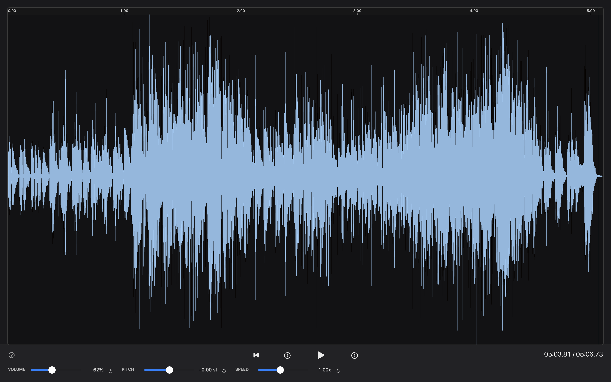

# OpenScribe

A free, open-source music transcription tool for macOS — built as an alternative to [Transcribe!](https://www.seventhstring.com/xscribe/overview.html).

> *"If I stop practice for one day, I notice it; two days, my friends notice it; three days, the public notices it."*
> — Hans von Bülow (1877)



## Features

- **Audio to MIDI** — `Analyze → Transcribe Track to MIDI…` (⇧⌘M) transcribes the loaded track with Spotify Basic Pitch and overlays detected notes on its waveform. Separated stems also offer “Transcribe to MIDI…” in their context menu. Pitched instruments work best; dense mixes and percussion may produce inaccurate notes.
- **Waveform visualizer** — see the full audio waveform at a glance
- **Mouse-driven loop selection** — drag to select any region, press Escape to clear
- **Pitch-preserving speed control** — slow down to 0.25× without changing the pitch
- **Pitch shifting** — transpose ±12 semitones independently of speed
- **Broad format support** — MP3, WAV, FLAC, AIFF, M4A / AAC
- **YouTube import** — paste a URL (`File → Open YouTube URL…`, ⇧⌘O) and the audio is downloaded and loaded into the editor
- **Sheet music panel** — open a PDF or image with `File → Open Sheet Music…` to read beside the waveform; zoom, fit the page, and reopen the same sheet when returning to a song.
- **iReal chord library** — `File → Browse iReal Library…` searches the popular iReal playlists and opens a selected chart beside the audio. Includes Jazz, Brazilian, Latin, Blues, Pop and Country collections, with source links and an Update Lists button.

## Requirements

- macOS 13 Ventura or later
- Xcode Command Line Tools (clang, Metal toolchain)

## Download

Grab the latest `.zip` from the [Releases](../../releases) page, unzip, and move `OpenScribeNative.app` to your Applications folder.

> **First launch:** right-click → Open to bypass the Gatekeeper warning (the app is not yet notarized).

## Build from Source

**Prerequisites:** Xcode Command Line Tools (`xcode-select --install`)

```bash
git clone https://github.com/yalindogusahin/openscribe.git
cd openscribe
bash cpp/build.sh 1.0.0
bash cpp/bundle_helper.sh # first build: bundle Python, ML dependencies and models
open cpp/OpenScribeNative.app
```

## Architecture

Native macOS app written in C++/Objective-C++ (Cocoa + AVFoundation + Metal).

| Layer | Files | Responsibility |
|---|---|---|
| App | `main.mm`, `AppDelegate.mm` | Entry point, lifecycle |
| Audio | `AudioEngine.mm` | AVFoundation pipeline, looping, time/pitch |
| Views | `MainWindow.mm`, `WaveformView.mm`, `TimelineRulerView.mm` | Cocoa + Metal-rendered waveform |
| Settings | `SettingsWindowController.mm` | Output device picker, prefs |

The audio pipeline uses `AVAudioPlayerNode → AVAudioUnitTimePitch → mainMixerNode → output`. `AVAudioUnitTimePitch` handles both speed (`rate`) and pitch (`pitch` in cents) natively. The waveform is rendered with a Metal shader (`WaveformShaders.metal`) for smooth zoom at any scale.

## Contributing

Contributions are welcome! See [CONTRIBUTING.md](CONTRIBUTING.md) for guidelines.

## License

[MIT](LICENSE)
